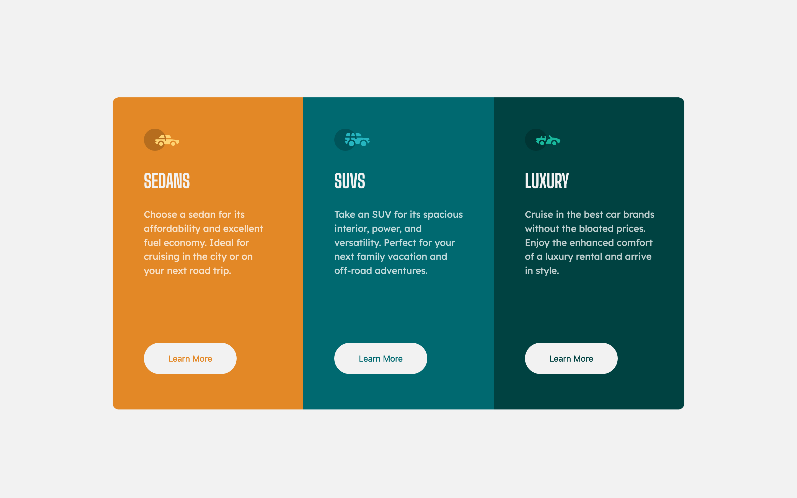

# Frontend Mentor - 3-column preview card component solution

This is a solution to the [3-column preview card component challenge on Frontend Mentor](https://www.frontendmentor.io/challenges/3column-preview-card-component-pH92eAR2-). Frontend Mentor challenges help you improve your coding skills by building realistic projects.

## Table of contents

- [Overview](#overview)
  - [The challenge](#the-challenge)
  - [Screenshot] (#screenshot)
  - [Links] (#links)
- [My process](#my-process)
  - [Built with](#built-with)
  - [Continued development](#continued-development)
  - [Useful resources](#useful-resources)
- [Author](#author)

## Overview

### The challenge

Users should be able to:

- View the optimal layout depending on their device's screen size
- See hover states for interactive elements

### screenshot

.

### links

- Solution URL: [3-column_preview_card_component](https://github.com/mayor-creator/3_column_preview_card_component)
- Live Site URL: [3-column_preview_card_component](https://github.com/mayor-creator/3_column_preview_card_component)

## My process

### Built with

- HTML
- CSS custom properties
- Flexbox
- Mobile-first workflow

### Continued development

- Flexbox sizing (Understanding how to use flex-grow, shrink and flex-basis)

### Useful resources

- [Flexbox Alignment](https://webdesign.tutsplus.com/tutorials/a-comprehensive-guide-to-flexbox-alignment--cms-30183) - This helped me to understand how the main axis and cross axis works in flexbox.

## Author

- Frontend Mentor - [@mayor-creator](https://www.frontendmentor.io/profile/mayor-creator)
- Twitter - [@mayor_creator](https://twitter.com/mayor_creator)
